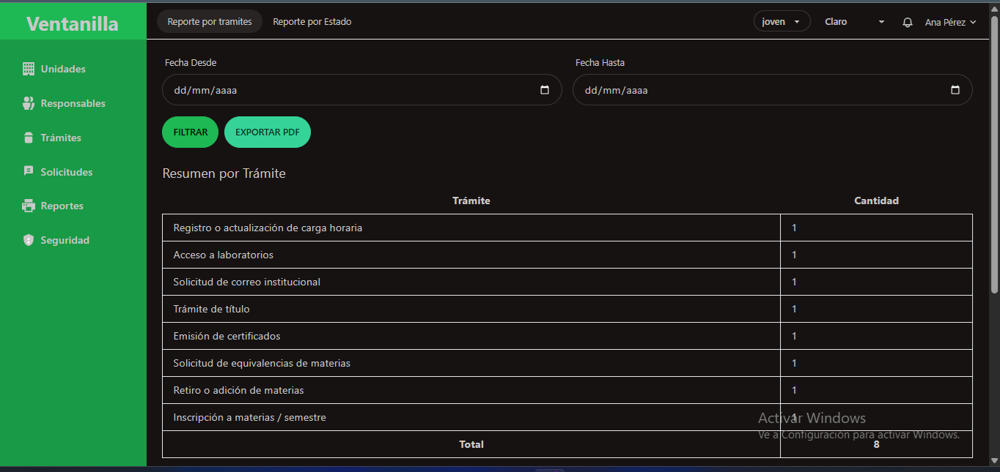

# Sistema de Ventanilla Única - FICCT



## 📋 Descripción

Sistema de Ventanilla Única para la Facultad de Informática, Ciencias de la Comunicación y Técnicas (FICCT). Es una aplicación web moderna que permite la gestión integral de trámites, solicitudes, workflows y usuarios con un sistema de permisos avanzado.

## ✨ Características Principales

### 🔐 Gestión de Seguridad
- **Usuarios**: Gestión completa de usuarios con roles y permisos
- **Roles**: Sistema de roles personalizables con permisos granulares
- **Permisos**: Control de acceso basado en permisos específicos
- **Autenticación**: Sistema de login seguro con Laravel Sanctum

### 📋 Gestión de Trámites
- **Trámites**: Creación y gestión de tipos de trámites
- **Solicitudes**: Proceso de solicitudes de trámites
- **Workflows**: Flujos de trabajo personalizables con pasos y transiciones
- **Seguimiento**: Seguimiento en tiempo real del estado de las solicitudes

### 🏢 Gestión Organizacional
- **Unidades**: Gestión de unidades administrativas
- **Responsables**: Asignación de responsables por trámite
- **Documentos**: Gestión de documentos asociados a trámites

### 📊 Reportes y Analytics
- **Reportes por Trámite**: Estadísticas de solicitudes por tipo de trámite
- **Reportes por Estado**: Análisis de estados de solicitudes
- **Dashboard**: Panel de control con métricas importantes
- **Visitas**: Contador de visitas por página

### 🔍 Funcionalidades Adicionales
- **Búsqueda Global**: Búsqueda en tiempo real en todas las entidades
- **Notificaciones**: Sistema de notificaciones en tiempo real
- **Temas**: Múltiples temas visuales (niño, joven, adulto)
- **Modo Oscuro/Claro**: Soporte para diferentes modos de visualización

## 🛠️ Tecnologías Utilizadas

### Backend
- **Laravel 11.1** - Framework PHP principal
- **PHP 8.2+** - Lenguaje de programación
- **MySQL/PostgreSQL** - Base de datos
- **Laravel Sanctum** - Autenticación API
- **Spatie Laravel Permission** - Gestión de roles y permisos
- **Laravel Workflow** - Gestión de flujos de trabajo
- **Laravel DomPDF** - Generación de PDFs
- **League Glide** - Procesamiento de imágenes

### Frontend
- **Vue.js 3.2** - Framework JavaScript
- **Inertia.js** - SPA sin API
- **Tailwind CSS 3.4** - Framework CSS
- **DaisyUI 3.6** - Componentes UI
- **Vite** - Build tool
- **Chart.js** - Gráficos y visualizaciones

### Herramientas de Desarrollo
- **ESLint** - Linting de JavaScript
- **Prettier** - Formateo de código
- **PHPStan** - Análisis estático de PHP
- **PHPUnit** - Testing

## 📦 Instalación

### Prerrequisitos
- PHP 8.2 o superior
- Composer 2.0 o superior
- Node.js 18 o superior
- MySQL 8.0 o PostgreSQL 13
- Servidor web (Apache/Nginx)

### 1. Clonar el repositorio
```bash
git clone <url-del-repositorio> ventanilla_unica
cd ventanilla_unica
```

### 2. Instalar dependencias PHP
```bash
composer install
```

### 3. Instalar dependencias Node.js
```bash
npm install
```

### 4. Configurar variables de entorno
```bash
cp .env.example .env
```

Editar el archivo `.env` con la configuración de tu base de datos:
```env
DB_CONNECTION=mysql
DB_HOST=127.0.0.1
DB_PORT=3306
DB_DATABASE=ventanilla_unica
DB_USERNAME=tu_usuario
DB_PASSWORD=tu_password
```

### 5. Generar clave de aplicación
```bash
php artisan key:generate
```

### 6. Ejecutar migraciones
```bash
php artisan migrate
```

### 7. Ejecutar seeders
```bash
php artisan db:seed
```

### 8. Compilar assets
```bash
npm run dev
```

### 9. Iniciar servidor de desarrollo
```bash
php artisan serve
```

## 🚀 Configuración de Producción

### 1. Optimizar para producción
```bash
composer install --optimize-autoloader --no-dev
npm run build
php artisan config:cache
php artisan route:cache
php artisan view:cache
```

### 2. Configurar servidor web
Para Apache, asegúrate de que el archivo `.htaccess` esté presente en la carpeta `public/`.

Para Nginx, configura el servidor para apuntar a la carpeta `public/`:
```nginx
server {
    listen 80;
    server_name tu-dominio.com;
    root /ruta/a/ventanilla_unica/public;

    add_header X-Frame-Options "SAMEORIGIN";
    add_header X-Content-Type-Options "nosniff";

    index index.php;

    charset utf-8;

    location / {
        try_files $uri $uri/ /index.php?$query_string;
    }

    location = /favicon.ico { access_log off; log_not_found off; }
    location = /robots.txt  { access_log off; log_not_found off; }

    error_page 404 /index.php;

    location ~ \.php$ {
        fastcgi_pass unix:/var/run/php/php8.2-fpm.sock;
        fastcgi_param SCRIPT_FILENAME $realpath_root$fastcgi_script_name;
        include fastcgi_params;
    }

    location ~ /\.(?!well-known).* {
        deny all;
    }
}
```

## 👥 Usuarios por Defecto

Después de ejecutar los seeders, tendrás acceso con:

### Administrador
- **Email**: johndoe@example.com
- **Password**: secret

### Usuarios de Prueba
- **Carlos Gómez**: Múltiples roles asignados
- **Ana Pérez**: Rol de administrador
- **Laura Méndez**: Sin roles asignados

## 📁 Estructura del Proyecto

```
ventanilla_unica/
├── app/
│   ├── Console/Commands/     # Comandos personalizados
│   ├── Http/Controllers/     # Controladores
│   ├── Models/              # Modelos Eloquent
│   ├── Services/            # Servicios de negocio
│   └── Traits/              # Traits reutilizables
├── database/
│   ├── migrations/          # Migraciones de BD
│   ├── seeders/            # Seeders de datos
│   └── factories/          # Factories para testing
├── resources/
│   ├── js/
│   │   ├── Pages/          # Páginas Vue.js
│   │   ├── Shared/         # Componentes compartidos
│   │   └── plugins/        # Plugins Vue.js
│   └── views/              # Vistas Blade
├── routes/                 # Definición de rutas
└── storage/                # Archivos subidos y logs
```

## 🔧 Comandos Útiles

### Desarrollo
```bash
# Compilar assets en modo desarrollo
npm run dev

# Compilar assets para producción
npm run build

# Ejecutar tests
php artisan test

# Limpiar cachés
php artisan cache:clear
php artisan config:clear
php artisan route:clear
php artisan view:clear
```

### Base de Datos
```bash
# Ejecutar migraciones
php artisan migrate

# Revertir migraciones
php artisan migrate:rollback

# Ejecutar seeders
php artisan db:seed

# Refrescar base de datos
php artisan migrate:fresh --seed
```

### Generación de Datos
```bash
# Generar datos de prueba para workflows
php artisan db:seed --class=WorkflowSeeder

# Generar datos de prueba para permisos
php artisan db:seed --class=PermissionSeeder
```

## 🧪 Testing

El proyecto incluye tests automatizados:

```bash
# Ejecutar todos los tests
php artisan test

# Ejecutar tests específicos
php artisan test --filter=UserTest

# Ejecutar tests con cobertura
php artisan test --coverage
```

## 📊 Monitoreo y Logs

### Logs de Aplicación
Los logs se encuentran en `storage/logs/laravel.log`

### Visitas
El sistema registra automáticamente las visitas a cada página. Los datos se almacenan en la tabla `visitas`.

### Notificaciones
Las notificaciones se gestionan a través del modelo `Notification` y se muestran en tiempo real.

## 🔒 Seguridad

### Autenticación
- Sistema de login seguro con Laravel Sanctum
- Protección CSRF automática
- Validación de sesiones

### Autorización
- Sistema de roles y permisos granular
- Middleware de autorización personalizado
- Control de acceso basado en permisos

### Validación
- Validación de entrada en todos los formularios
- Sanitización de datos
- Protección contra inyección SQL

## 🤝 Contribución

1. Fork el proyecto
2. Crea una rama para tu feature (`git checkout -b feature/AmazingFeature`)
3. Commit tus cambios (`git commit -m 'Add some AmazingFeature'`)
4. Push a la rama (`git push origin feature/AmazingFeature`)
5. Abre un Pull Request

## 📝 Licencia

Este proyecto está bajo la Licencia MIT. Ver el archivo `LICENSE.md` para más detalles.

## 📞 Soporte

Para soporte técnico o consultas:
- **Email**: soporte@ficct.edu.bo
- **Teléfono**: +591-XXX-XXXX
- **Documentación**: [Enlace a documentación]

## 🔄 Actualizaciones

Para mantener el sistema actualizado:

```bash
# Actualizar dependencias PHP
composer update

# Actualizar dependencias Node.js
npm update

# Ejecutar migraciones nuevas
php artisan migrate

# Limpiar cachés después de actualizaciones
php artisan cache:clear
php artisan config:clear
```

---

**Desarrollado con ❤️ para la Facultad de Informática, Ciencias de la Comunicación y Técnicas**
